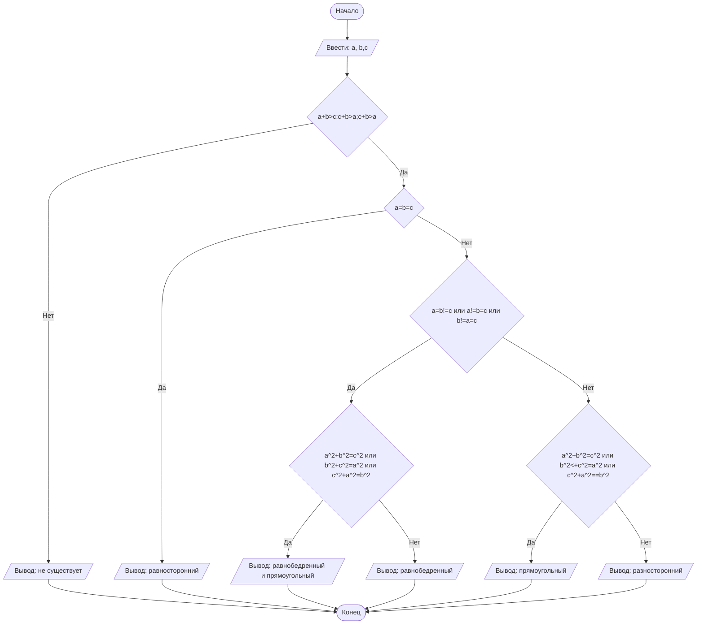

## Отчет по лабораторной работе № 1

#### № группы: `ПМ-2501`

#### Выполнил: `Ларичева Валерия Викторовна`

#### Вариант: `10`

### Cодержание:

- [Постановка задачи](#1-постановка-задачи)
- [Входные и выходные данные](#2-входные-и-выходные-данные)
- [Выбор структуры данных](#3-выбор-структуры-данных)
- [Алгоритм](#4-алгоритм)
- [Программа](#5-программа)
- [Анализ правильности решения](#6-анализ-правильности-решения)

### 1. Постановка задачи

> Три отрезка длиной A, B и C пытаются образовать треугольник. Прове
рить, возможно ли составить треугольник из этих отрезков, и если да, то
 определить, какой это треугольник: равносторонний, равнобедренный, раз
носторонний или прямоугольный. На вход программы подаются натураль
ные числа A, B, C.

Данную задачу можно разделить на 2 подзадачи: проверка возможности составить треугольник из данных отрезков и определение его типа.

- Для 1 подзадачи нужно рассмотреть 4 случая:
    1. `A+B>C`;`A+C>B`;`B+C>A`
    2. `A+B<=C`
    3. `A+C<=B`
    4. `C+B<=A`
- Пусть отрезки длиной A,B и C образуют треугольник, тогда для 2 подзадачи нужно также рассмотреть 4 случая:
    1. `A=B=C`
    2. `A=B и A!=C`;`A=C и A!=B`,`C=B и A!=C`
    3. `A!=B!=C`
    4. `A`<sup>'2'</sup>+`B`<sup>'2'</sup>=`C`<sup>'2'</sup>;`A`<sup>'2'</sup>+`C`<sup>'2'</sup>=`B`<sup>'2'</sup>;`C`<sup>'2'</sup>+`B`<sup>'2'</sup>=`A`<sup>'2'</sup>

### 2. Входные и выходные данные

#### Данные на вход

На вход программа должна получать 3 натуральных числа.

|             | Тип                | min значение    | max значение     |
|-------------|--------------------|-----------------|------------------|
| A (Число 1) | Целое число        | 1               | 2<sup>31</sup>-1 |
| B (Число 2) | Целое число        | 1               | 2<sup>31</sup>-1 |
| C (Число 3) | Целое число        | 1               | 2<sup>31</sup>-1 |

#### Данные на выход

Если из отрезков A,B и С можно составить треугольник , то на выход мы получим
тип треугольника. Если не получается треульник, то выведет, что его не существует.

|         | Тип                                | 
|---------|------------------------------------|
| Строка  | Строковый                          |            

### 3. Выбор структуры данных

Программа получает 3 натуральных числа, не превышающих 2<sup>31</sup>-1. Поэтому для их хранения
можно выделить 3 переменных (`a` и `b` и `с`) типа `int`.

|             | название переменной | Тип (в Java) | 
|-------------|---------------------|--------------|
| A (Число 1) | `a`                 | `int`        |
| B (Число 2) | `b`                 | `int`        | 
| C (Число 2) | `c`                 | `int`        | 
Для вывода результата необязательно его хранить в отдельной переменной.

### 4. Алгоритм

#### Алгоритм выполнения программы:

1. **Ввод данных:**  
   Программа считывает три числа, обозначенные как `a`,`b` и `с`.

2. **Сравнение чисел:**  
   Программа сравнивает значения `a`,`b` и `с`. Если `a`+`b` больше `c`, программа переходит к следующему шагу для
   работы с `x`. Если `y` больше, программа выполняет действия для работы с `y`.

3. **Проверка знака для выбранного числа:**
    - Если было выбрано число `x` (так как оно больше или равно `y`), проверяется, положительное оно или отрицательное.
      Если `x` положительное, оно выводится на экран. Если отрицательное, выводится его модуль (т.е. противоположное
      по знаку значение).
    - Если было выбрано число `y` (поскольку оно больше `x`), выполняется аналогичная проверка. Если `y` положительное,
      оно выводится на экран. Если отрицательное, выводится его модуль.

4. **Вывод результата:**  
   На экран выводится либо большее из чисел, либо его модуль, если это число отрицательное.

#### Блок-схема



### 5. Программа

```java
import java.io.PrintStream;
import java.util.Scanner;

public class Main {
    // Объявляем объект класса Scanner для ввода данных
    public static Scanner in = new Scanner(System.in);
    // Объявляем объект класса PrintStream для вывода данных
    public static PrintStream out = System.out;

    public static void main(String[] args) {
        // Считывание двух вещественных чисел x и y из консоли
        double x = in.nextDouble();
        double y = in.nextDouble();

        // Определение максимального числа
        if (x >= y) {
            // Если x положительное, выводим x, иначе выводим -x,
            // чтобы на выходе было его абсолютное значение
            if (x >= 0) {
                out.println(x);
            } else {
                out.println(-x);
            }
        } else {
            // Если x положительное, выводим y, иначе выводим -y,
            // чтобы на выходе было его абсолютное значение
            if (y >= 0) {
                out.println(y);
            } else {
                out.println(-y);
            }
        }
    }
}
```

### 6. Анализ правильности решения

Программа работает корректно на всем множестве решений с учетом ограничений.

1. Тест на `X > Y > 0`:

    - **Input**:
        ```
        5 1.3
        ```

    - **Output**:
        ```
        5
        ```

2. Тест на `X < Y < 0`:

    - **Input**:
        ```
        -4 -2.2
        ```

    - **Output**:
        ```
        2.2
        ```

3. Тест на `X < 0 < Y`:

    - **Input**:
        ```
        -4 5
        ```

    - **Output**:
        ```
        5
        ```

4. Тест на `X = 0` или `Y = 0`:

    - **Input**:
        ```
        0 -3
        ```

    - **Output**:
        ```
        3
        ```

5. Тест на ограничение задачи:

    - **Input**:
        ```
        -1000000000 1000000000
        ```

    - **Output**:
        ```
        1000000000
        ```
