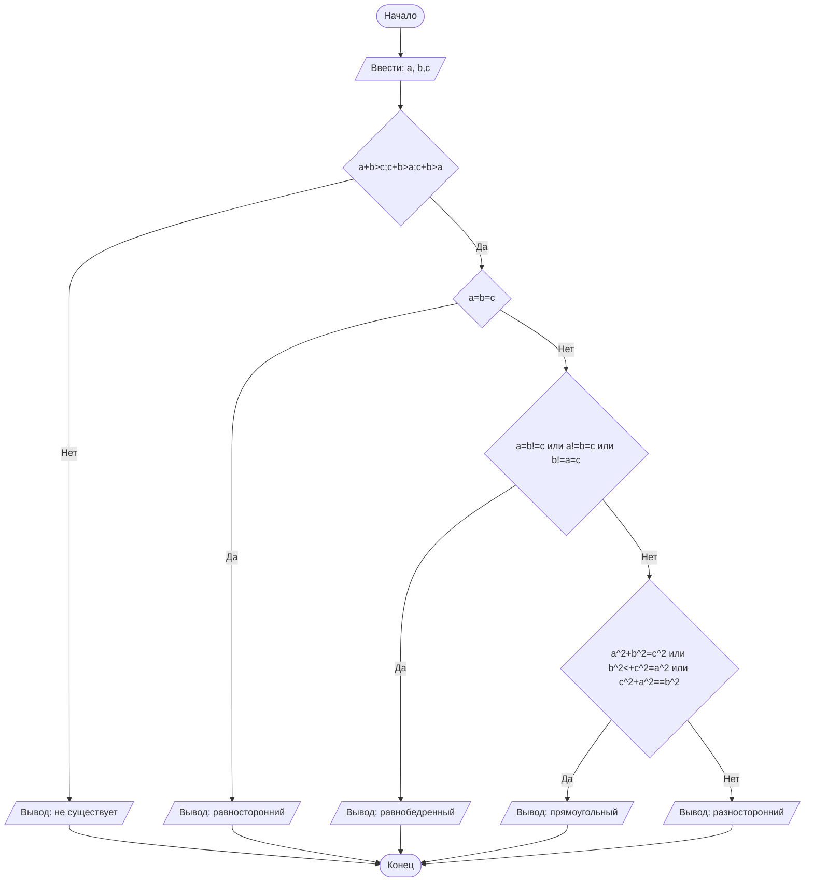

## Отчет по лабораторной работе № 1

#### № группы: `ПМ-2501`

#### Выполнил: `Ларичева Валерия Викторовна`

#### Вариант: `10`

### Cодержание:

- [Постановка задачи](#1-постановка-задачи)
- [Входные и выходные данные](#2-входные-и-выходные-данные)
- [Выбор структуры данных](#3-выбор-структуры-данных)
- [Алгоритм](#4-алгоритм)
- [Программа](#5-программа)
- [Анализ правильности решения](#6-анализ-правильности-решения)

### 1. Постановка задачи

> Три отрезка длиной A, B и C пытаются образовать треугольник. Прове
рить, возможно ли составить треугольник из этих отрезков, и если да, то
 определить, какой это треугольник: равносторонний, равнобедренный, раз
носторонний или прямоугольный. На вход программы подаются натураль
ные числа A, B, C.

Данную задачу можно разделить на 2 подзадачи: проверка возможности составить треугольник из данных отрезков и определение его типа.

- Для 1 подзадачи нужно рассмотреть 4 случая:
    1. `A+B>C`;`A+C>B`;`B+C>A`
    2. `A+B<=C`
    3. `A+C<=B`
    4. `C+B<=A`
- Пусть отрезки длиной A,B и C образуют треугольник, тогда для 2 подзадачи нужно также рассмотреть 4 случая:
    1. `A=B=C`
    2. `A=B и A!=C`;`A=C и A!=B`,`C=B и A!=C`
    3. `A!=B!=C`
    4. `A`<sup>'2'</sup>+`B`<sup>'2'</sup>=`C`<sup>'2'</sup>;`A`<sup>'2'</sup>+`C`<sup>'2'</sup>=`B`<sup>'2'</sup>;`C`<sup>'2'</sup>+`B`<sup>'2'</sup>=`A`<sup>'2'</sup>

### 2. Входные и выходные данные

#### Данные на вход

На вход программа должна получать 3 натуральных числа.

|             | Тип                | min значение    | max значение     |
|-------------|--------------------|-----------------|------------------|
| A (Число 1) | Целое число        | 1               | 2<sup>31</sup>-1 |
| B (Число 2) | Целое число        | 1               | 2<sup>31</sup>-1 |
| C (Число 3) | Целое число        | 1               | 2<sup>31</sup>-1 |

#### Данные на выход

Если из отрезков A,B и С можно составить треугольник , то на выход мы получим
тип треугольника. Если не получается треульник, то выведет, что его не существует.

|         | Тип                                | 
|---------|------------------------------------|
| Строка  | Строковый                          |            

### 3. Выбор структуры данных

Программа получает 3 натуральных числа, не превышающих 2<sup>31</sup>-1. Поэтому для их хранения
можно выделить 3 переменных (`a` и `b` и `с`) типа `int`.

|             | название переменной | Тип (в Java) | 
|-------------|---------------------|--------------|
| A (Число 1) | `a`                 | `int`        |
| B (Число 2) | `b`                 | `int`        | 
| C (Число 2) | `c`                 | `int`        | 
Для вывода результата необязательно его хранить в отдельной переменной.

### 4. Алгоритм

#### Алгоритм выполнения программы:

1. **Ввод данных:**  
   Программа считывает три числа, обозначенные как `a`,`b` и `с`.

2. **Сравнение чисел:**  
   Программа сравнивает значения `a`,`b` и `с`. Если `a`+`b` меньше `c`, значит треугольник составить из данных отрезков нельзя и программа выводит на экран, что треугольника не существует. Если `a`+`b` больше `c`, то программа проверяет остальные неравенства, что `a`+`c` больше `b` и `c`+`b` больше `a`. Если все неравенства верны, то программа переходит к следующему шагу.

3. **Определения типа треугольника:**
    - Если `a` равно `b` и равно `c`, то на экран выводится, что треульник равносторонний.
    - Если `a` равно `b` и не равно `c`, то экран выводится, что треульник равнобедренный. Аналогично, если `a` равно `c` и не равно `b` или `c` равно `b` и не равно `a`, то треугольники равнобедренные.
    - Если `a` не равно `b` и не равно `c`, то на экран выводится, что треульник разносторонний.
    - Если `a`<sup>'2'</sup>+`b`<sup>'2'</sup>=`c`<sup>'2'</sup>, то на экран выводится, что треульник прямоугольный. Аналогично, если `a`<sup>'2'</sup>+`b`<sup>'2'</sup>=`c`<sup>'2'</sup> или `c`<sup>'2'</sup>+`b`<sup>'2'</sup>=`a`<sup>'2'</sup>, то треугольник прямоугольный.

4. **Вывод результата:**  
   Если треульник из данных отрезков существует, то на экран выводится тип треугольника.

#### Блок-схема



### 5. Программа
```java
import java.util.Scanner;

class Main{
    public static void main(String[] args){
        Scanner in = new Scanner(System.in);
        int a = in.nextInt();
        int b = in.nextInt();
        int c = in.nextInt();
        if (!(a+b>c && c+b>a && c+a>b)) {    //проверяем существует треугольник
            System.out.println("Не существует");
        }
        else {if (a==b && b==c){     //проверяем равенство сторон
            System.out.println("Равносторонний");}
            else {if (a==b && b!=c || a==c && a!=b || c==b && a!=c){ //проверяем равнобедренный треугольник
               System.out.println("Равнобедренный");}
            else {if (a*a+b*b==c*c || a*a+c*c==b*b || c*c+b*b==a*a){ //проверяем прямоугольный треугольник
            System.out.println("прямоугольный");}
            else {
            System.out.println("разносторонний");} //остальные случаи треугольник разносторонний
        }
        }
        }
```
### 6. Анализ правильности решения

Программа работает корректно на всем множестве решений с учетом ограничений.

1. Тест на прямоугольный треугольник `A^2+B^2=C^2`:

    - **Input**:
        ```
        3 4 5
        ```

    - **Output**:
        ```
        прямоугольный
        ```

2. Тест на равносторонний треугольник`A=B=C`:

    - **Input**:
        ```
        3 3 3
        ```

    - **Output**:
        ```
        равносторонний
        ```

3. Тест на равнобедренный треугольник `A=B!=C или A!=B=C или A=C!=B `:

    - **Input**:
        ```
        2 2 3
        ```

    - **Output**:
        ```
        равнобедренный
        ```

4. Тест на разносторонний треугольник `A!=B!=C`:

    - **Input**:
        ```
       3 4 6
        
        ```

    - **Output**:
        ```
        разносторонний
        ```

5. Тест на несуществования треугольника:

    - **Input**:
        ```
        1 2 10
        ```

    - **Output**:
        ```
        не существует
        ```
